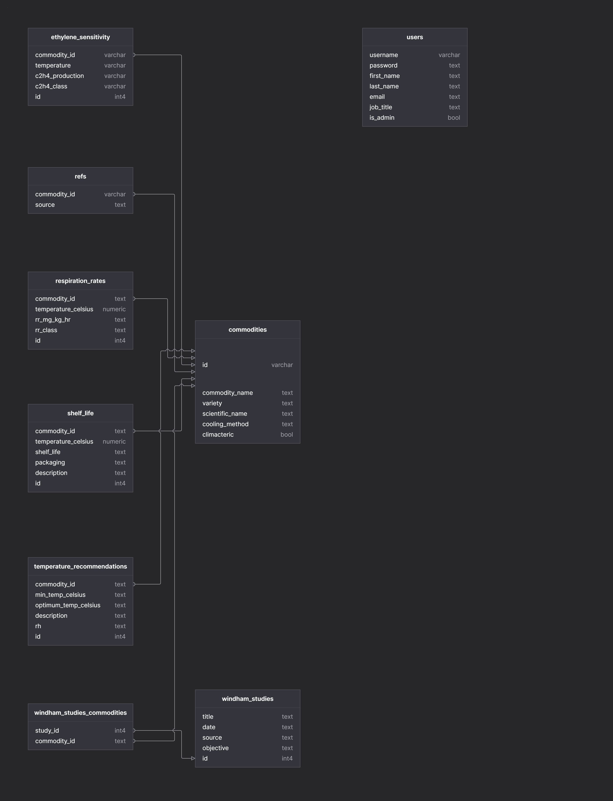

# postharvest-app-backend

## Project Summary
This Postharvest app allows a user to look up information on various fruit and vegetable commodities. The user is able to log in, register, search for commodities by name and view temperature, shelf life, respiration, ethylene, and reference data. Admins can view and download Windham Packaging shelf life studies associated with each fruit or vegetable (commodity). Admins have the ability to add and edit commodities and associated information. This app is designed for Windham Packaging, LLC, a company that provides specialized packaging for fresh produce. The admins will be myself and the owner, Dr. Elizabeth Marston. This is an evenly-focused full stack application.  

## User Flow
### Routes
#### /auth
 - **POST /auth/token**: Takes username and password from req.body when user tries to log in. Authenticates username and password using User.authenicate and returns a JWT token. Authorization required: none
 - **GET /auth/login**: Takes token generated from /token and verifies it. Throws 401 error if there is an error. Otherwise allows user to proceed. Authorization required: none
 - **POST /auth/register**: Takes { username, password, firstName, lastName, email } from req.body. Returns JWT token which can be used to authenticate further requests. Authorization required: none

#### /users
- **POST /users**: { user }  => { user, token }. Adds a new user. This returns the newly created user and an authentication token for them: {user: { username, firstName, lastName, email, isAdmin }, token }. Authorization required: none
- **GET /users**: { users: [ {username, firstName, lastName, email, jobTitle }, ... ] }. Returns list of all users. Authorization required: admin. (Not implemented currently. Will be used in the future to make a list of users. Admin will be able to patch users, i.e. change user to admin or change password if user is locked out)
- **GET /users/:username**: /[username] => { user }. Returns { username, firstName, lastName, isAdmin, jobTitle }.  Authorization required: admin or same user-as-:username
- **PATCH /users/:username**: /[username] {user} => { user }. Data can include: { firstName, lastName, password, email }. Returns { username, firstName, lastName, isAdmin, jobTitle }.  Authorization required: admin or same user-as-:username. 
- **DELETE /users/:username**: /[username]  =>  { deleted: username }. Authorization required: admin or same user-as-:username. 

#### /commodities
- **POST /commodities**: POST / { commodity }  => { commodity: {id, commodityName, variety, scientificName, coolingMethod, climacteric } Adds a new commodity. This returns the newly created commodity. Authorization required: admin
- **GET /commodities**: GET / => { commodities: [ {commodityName, variety, scientificName, coolingMethod, climacteric }, ... ] } Returns list of all commodities. Authorization required: none. 
- **GET /commodities/:id**: GET /[id] => { commodity } Returns { commodity: [ {commodityName, variety, scientificName, coolingMethod, climacteric, ethyleneSensitivity, respirationRate, shelfLife, references, studies, temperatureRecommendations }, ... ] }  
- **PATCH /commodities/:id**:PATCH /[id] { commodity } => { commodity } Data can include: { commodityName, variety, scientificName, coolingMethod, climacteric } Returns { id, commodityName, variety, scientificName, coolingMethod, climacteric }
- **DELETE /commodities/:id**: DELETE /[id]  =>  { deleted: id } Authorization required: admin 

#### /ethylene
- **POST /ethylene**: POST / { commodity }  => { commodity: {id, commodityName, variety, scientificName, coolingMethod, climacteric } Adds a new commodity. This returns the newly created commodity. Authorization required: admin
- **GET /ethylene**: GET /[ethyleneId] => {ethylene} Pass in ethylene id in req.params. Returns  {ethylene: {id: int, commodityId: str, temperature: str, c2h4Production: str, c2h4Class: str}}. Authorization required: none
- **GET /ethylene/commodity/:id**:  GET ethylene/commodity/[commodityId] => [...{ ethylene }]. Returns{
ethylene: [{id: int,commodityId: str,temperature: str,c2h4Production: str,c2h4Class: str}]}. Authorization required: none
- **PATCH /ethylene/:id**:PATCH /[id] { ethylene } => { ethylene } Data can include: { temperature: str,  c2h4Production: str, c2h4Class: str } Returns  { ethylene: { id: int, commodityId: str, temperature: str, c2h4Production: str, c2h4Class: str}} Authorization required: admin
- **DELETE /ethylene/:id**: DELETE /[id]  =>  { deleted: id } Authorization required: admin 

#### /shelf-life
- **POST /shelf-life**: POST / { reference }  => { reference }. Adds a new reference object. This returns the newly created shelf life data {reference: {id, commodityId, shelfLife, packaging, description} }. Authorization required: admin
- **GET /shelf-life/:id**: GET /[shelfLifeId] => {shelfLife}. Pass in a study id in req.params. Returns  {shelfLife: { id: int, commodityId: str, shelfLife: str, packaging: str, description: str}} Authorization required: none. 
- **GET /shelf-life/commodity/:id**: GET /[commodityId] => [...{ shelfLife }] Returns{shelfLife: [{id: 929, commodityId: 'id', shelfLife: '1 day', packaging: 'test', description: 'test'}]}
- **PATCH /shelf-life/:id**:PATCH /[id] { shelfLife } => { shelfLife } Data can include: { shelfLife, temperature, packaging, description } Returns  {shelfLife: {id: int, commodityId: str, shelfLife: str, packaging: str, description: str}}Authorization required: admin
- **DELETE /shelf-life/:id**: DELETE /[id]  =>  { deleted: id } Authorization required: admin 

#### /respiration
- **POST /respiration**: PPOST / { respiration }  => { respiration }. Adds a new respiration rate object. This returns the newly created respiration rate data  {respiration: {id, commodityId, temperature, rrRate, rrClass} } Authorization required: admin
- **GET /respiration**: GET /[respirationId] => {respiration}. Pass in a respiration id in req.params. Returns  {       respiration: {id, commodityId, temperature, rrRate, rrClass} } Authorization required: none. 
- **GET /respiration/commodity/:id**: GET /[commodityId] => [...{ respiration }] Returns{respiration: [{id: int,commodityId: str, temperature: str, rrRate: str, rrClass: str}]}
- **PATCH /respiration/:id**:PATCH /[id] { shelfLife } => { shelfLife }  Data can include: { temperature, rrRate, rrClass } Returns  {   respiration: {id: int, commodityId: str, temperature: str, rrRate: str, rrClass: str}} Authorization required: admin
- **DELETE /respiration/:id**: DELETE /[id]  =>  { deleted: id } Authorization required: admin 

#### /temperature
- **POST /temperature**: POST / { temperature }  => { temperature }. Adds a new temperature recommendation object. This returns the newly created temperature recommendation data {temperature: {id, commodityId, minTemp, optimumTemp, description, rh} }. Authorization required: admin
- **GET /temperature/:id**: GET /[temperatureId] => {temperature}. Pass in a temperature id in req.params. Returns  {temperature: {id, commodityId, minTemp, optimumTemp, description, rh}. Authorization required: none. 
- **POST /temperature**: POST / { temperature }  => { temperature }. Adds a new temperature recommendation object. This returns the newly created temperature recommendation data {temperature: {id, commodityId, minTemp, optimumTemp, description, rh} }. Authorization required: admin
- **GET /temperature/commodity/:id**: GET /[commodityId] => [...{ temperature }]. Returns{temperature: [{id, commodityId,minTemp, optimumTemp, description, rh}]}Authorization required: none. 
- **PATCH /temperature/:id**:PATCH /[id] { temperature } => { temperature }. Data can include: { minTemp, optimumTemp, description, rh } Returns  {temperature: {id, commodityId, minTemp, optimumTemp, description, rh}} Authorization required: admin
- **DELETE /temperature/:id**: DELETE /[id]  =>  { deleted: id } Authorization required: admin 

#### /refs
- **POST /ref**: POST / { reference }  => { reference }. Adds a new reference object. This returns the newly created reference data {reference: { commodityId, source} } Authorization required: admin
- **GET /ref**:  GET /[commodityId] => [...{ reference }]. Returns{reference: [{commodityId, source}]} Authorization required: none. 
- **GET /ref/:id**: GET /[commodityId] => [...{ reference }] Returns{reference: [{commodityId, source}]} Authorization required: none. 
- **DELETE /ref/:id**: DELETE /[id]  =>  { deleted: id } Authorization required: admin 

#### /studies
- **POST /studies**: POST / { study }  => { study }. Adds a new Windham Packaging study object. This returns the newly created study data {study: {id,  title, date, source, objective} }. Authorization required: admin. (Not implemented yet.)
- **GET /studies**:GET /=> {studies} Authorization required: admin. Returns a list of all studies. Returns  {studies:[ {id, title, date, source, objective}] Authorization required: admin.
- **GET /studies/:id**: GET /[studyId] => {study} Pass in a study id in req.params. Returns  {study: {id, title, date, source, objective} Authorization required: admin.
- **PATCH /studies/:id**: PATCH /[id] { study } => { study }. Data can include { title, date, objective }. Returns  {study: {id, title, date, source, objective} Authorization required: admin.
- **DELETE /studies/study**: /[studyId] Delete all entries with studyId from windham_studies_commodities. Authorization required: admin Authorization required: admin.
- **POST /studies/commodity/:id**: POST /:commodityId {data: studyId, commodityId}=> { studyCommodity: { commodityId, studyId } }. Link a windham study to one or multiple commodities from commodities table Authorization required: admin.
- **GET /studies/commodity/:id**: GET /studies/commodity/:id => { studyCommodity: { commodityId, studyId } }.  list all Windham studies associated with a commodity Authorization required: admin.
- **GET /studies/study/:id**: GET /studies/study/:id => { studyCommodity: { commodityId, studyId } }. list all Windham commodities associated with a study Authorization required: admin.
- **DELETE /studies/study/:id**: Delete all entries with studyId from windham_studies_commodities Authorization required: admin.

### Middleware
- Uses *morgan*, HTTP request logger middleware for node.js
- Uses *jsonwebtoken* to verify tokens
- **authenticateJWT**: If a token was provided, verify it, and, if valid, store the token payload on res.locals (this will include the username and isAdmin field.). Does not throw error if no token was provided or if the token is not valid.
- **ensureLoggedIn**:  Middleware to use when user must be logged in. If not, raises Unauthorized error
- **ensureAdmin**: Middleware to use when they be logged in as an admin user. If not, raises Unauthorized error
- **ensureCorrectUserOrAdmin**:  Middleware to use when they must provide a valid token & be user matching username provided as route param. If not, raises Unauthorized error.

 ## Data model
 ### Schema

 #### User
 - **authenticate**: authenticate user with username, password. Returns { username, first_name, last_name, email, is_admin }. Throws UnauthorizedError is user not found or wrong password.
 - **register**: Register user with data { username, firstName, lastName, email, jobTitle, isAdmin=false }. Returns { username, firstName, lastName, email, isAdmin }.Throws BadRequestError on duplicates.
 - **findAll**: Find all users. Returns [{ username, first_name, last_name, email, is_admin }, ...]. 
 - **get**: Given a username, return data about user. Returns { username, first_name, last_name, is_admin, jobTitle, email }. Throws NotFoundError if user not found.
 - **update**:  Update user data with `data`. This is a "partial update" --- it's fine if data doesn't contain all the fields; this only changes provided ones. Data can include: { firstName, lastName, password, email, isAdmin, jobTitle }. Returns { username, firstName, lastName, email, jobTitle, isAdmin } *WARNING: this function can set a new password or make a user an admin.*
 - **remove**: Delete given user from database; returns undefined.

#### Commodity
- **create**: Create a commodity (from data), update db, return new commodity data. Data should be {id, commodityName, variety, scientificName, coolingMethod, climacteric} Returns {id, commodityName, variety, scientificName, coolingMethod, climacteric }
- **findAll**: Find all commodities and filter by commodity_name. Returns [{ commodityName, variety, scientificName, coolingMethod, climacteric }, ...]
- **get** Given a commodity id, return data about commodity. Returns { commodityName, variety, scientificName, coolingMethod, climacteric }
    where ethyleneSensitivity is [...{ id, commodityId, c2h4Productiom, c2h4Class, temperature  }]
    where respirationRate is [...{id, commodityId, rrRate, rrClass, temperature}]
    where shelfLife is [...{id, commodityId, temperature, shelfLife, packaging, descrpiption}]
    where temperatureRecommendations is [...{id, commodityId, minTemp, optimumTemp, description, rh}]
    where studies is [...{id, title, date, source, objective}]
    where refs is [...{commodityId, source}]
Throws NotFoundError if commodity not found.
- **update**: Given an id and data, updates a commodity
- **delete**: removes commodity by id

#### Ethylene
- **create**: Create ethylene sensitivity information (from data), update db, return new ethylene sensitivity data. Data should be {commodityId, temperature, c2h4Production, c2h4Class}. Returns {commodityId, temperature, c2h4Production, c2h4Class}
- **getById** Given an id, return ethylene sensitivity data.  Returns { commodityId, temperature, c2h4Production, c2h4Class, id } Throws NotFoundError if commodity not found.
- **getByCommodity**: Given a commodity id, return all ethylene sensitivty data about commodity. Returns [...{ commodityId, temperature, c2h4Production, c2h4Class, id }] Throws NotFoundError if commodity not found.
- **update**: Given an id, update ethylene sensitivity data. Returns { commodityId, temperature, c2h4Production, c2h4Class, id }
- **delete**: removes ethylene data by id. Returns "deleted" message

#### Respiration
- **create**: Create shelf life information (from data), update db, return new shelf life data. Data should be {commodityId, temperature, shelfLife, description, packaging}. Returns {id, commodityId, temperature, shelfLife, description, packaging}. Temperature is in celsius
- **getById**  Given an id, return shelf life data. Returns {id, commodityId, temperature, shelfLife, description, packaging} Throws NotFoundError if id not found.
- **getByCommodity**:  Given a commodity id, return all shelf life data about commodity.  Returns [...{ id, commodityId, temperature, shelfLife, description, packaging }] Throws NotFoundError if commodity not found.
- **update**: Given an id, return new shelf life data. Data should be {commodityId, temperature, rrRate, rrClass} Returns {id, commodityId, temperature, rrRate, rrClass}	Respiration rate is in units mm * kg * hrData should be { commodityId, temperature, shelfLife, description, packaging. Returns {id, commodityId, temperature, shelfLife, description, packaging} Temperature is in celsius**/
- **delete**: removes respiration data by id. Returns "deleted" message

#### Temperature
- **create**: Create temperature recommendation information (from data), update db, return new temperature recommendation data. Data should be {commodityId, minTemp, optimumTemp, description, rh}. Returns {id, commodityId, minTemp, optimumTemp, description, rh}. Temperature is in celsius. RH is relative humidity (%)
- **getById**  Given an id, return temperature recommendation data. Returns {id, commodityId, minTemp, optimumTemp, description, rh} Throws NotFoundError if id not found.
- **getByCommodity**:  Given a commodity id, return all temperature about commodity. Returns [...{ id, commodityId, minTemp, optimumTemp, rh }]. Throws NotFoundError if commodity not found.
- **update**: Given an id, return new temperature data. Data should be {  minTemp, optimumTemp, rh}. Returns {id, commodityId, minTemp, optimumTemp, rh}. Temperature is in celsius
- **delete**: removes temperature data by id. Returns "deleted" message

#### ShelfLife
- **create**: Create respiration rate information (from data), update db, return new respiration rate data. Data should be {commodityId, temperature, rrRate, rrClass}. Returns {id, commodityId, temperature, rrRate, rrClass}. Respiration rate is in units mm x kg x hr. Temperature is in celsius
- **getById**  Given an id, return respiration rate data. Returns {id, commodityId, temperature, rrRate, rrClass} Throws NotFoundError if commodity not found.
- **getByCommodity**: Given a commodity id, return all respiration rate data about commodity. Returns [...{ id, commodityId, temperature, rrRate, rrClass }] Throws NotFoundError if commodity not found.
- **update**: Given an id, return new respiration rate data. Data should be {commodityId, temperature, rrRate, rrClass} Returns {id, commodityId, temperature, rrRate, rrClass}	Respiration rate is in units mm * kg * hr Temperature is in celsius**/
- **delete**: removes respiration data by id. Returns "deleted" message

#### WindhamStudies
- **create**: Create windham study (from data), update db, return new windham study data. Data should be { title, date, source, objective}.  Returns {id, title, date, source, objective}
- **getAll**: Get data for all studies. Returns [...{ id, title, date, objective, commodities }] where commodities=[...{commodityName, variety}] Throws NotFoundError if study not found.
- **getById**: Given an id, return study data. Returns { id, title, date, objective }. Throws NotFoundError if study not found.
- **update**: Given an id, update windham study (from data), update db, return new windham study data. Data should be { title, date, source, objective}. Returns {id, title, date, source, objective}
- **delete**: removes respiration data by id. Returns "deleted" message

#### WindhamStudiesCommodities
- **create**: Create windham study relationship with commodity(from data), update db, return new windham study data. Data should be { commodityId, studyId}. Returns {commodityId, studyId}
- **getByStudyId**: Given a study id, return all commodities associated with that study.  Returns { studyId:[...commodities] } Throws NotFoundError if study not found.
- **getByCommodityId**: Given a commodity id, return all studies associated with that study. Returns { commodityId:[...studyIds] }.  Throws NotFoundError if study not found.
- **update**: Given an id, update windham study (from data), update db, return new windham study data. Data should be { title, date, source, objective}. Returns {id, title, date, source, objective} 
- **delete**: Given an id, remove windham study data. Returns "deleted" message

#### References
- **create**: Create reference information (from data), update db, return new reference data. Data should be {commodityId, source}. Returns {commodityId, source}
- **getByCommodity**: Given a commodity id, return all reference data about commodity. Returns [...{ commodityId, source }] Throws NotFoundError if commodity not found.
- **remove**: Given a commodityId and a source, removes reference.

## API
- I made my own API using the research I have done as a Postharvest Specialist as well as the UC Davis Postharvest Database and USDA Handbook 66.
- https://postharvest.ucdavis.edu/Commodity_Resources/Fact_Sheets/
- https://www.ars.usda.gov/arsuserfiles/oc/np/commercialstorage/commercialstorage.pdf

## Tech Stack
- Node.js
- PostgresQL
- Express

## Testing
- Jest
- Supertest

